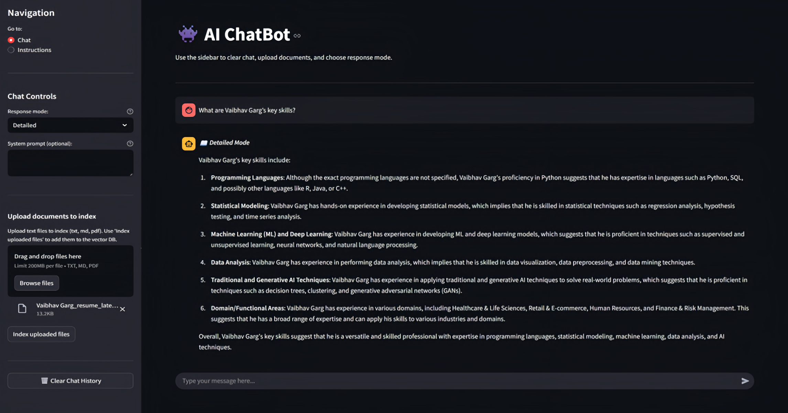

# 🤖 AI Knowledge Explorer

A smart, conversational AI chatbot built using Streamlit that integrates local document retrieval (RAG) and real-time web search (via SerpAPI). Powered by LLaMA3 via GROQ, this assistant provides accurate and context-aware answers for general knowledge, uploaded documents, and live queries.

---

## 🌐 Live Website
You can try the tool live here: **[AI Knowledge Explorer](https://vaibhav-project-ai-knowledge-explorer.streamlit.app/)**

---

## 🎥 Presentation
Watch the full project presentation here: **[AI Knowledge Explorer](https://vaibhavgarg2004.github.io/presentations/Presentations/AI%20Knowledge%20Explorer%20Presentation.pdf)**

---

## 🛠 Features  
- Clean and responsive Streamlit-based web interface  
- Supports multiple query types:  
  - **RAG Queries**: Semantic retrieval from uploaded documents for knowledge-based questions  
  - **Web Search Queries**: Real-time search using SerpAPI as fallback or forced search  
  - **Mixed Queries**: Handles questions combining document context and general knowledge  
- Flexible **Response Modes**:  
  - **Detailed**: Step-by-step contextual answers  
  - **Concise**: Short, direct answers  
- Fast and accurate responses powered by **LLaMA-3 via GROQ API**  
- Modular and well-structured codebase for quick customization and scaling  

---

## 📂 Project Structure

```
AI Knowledge Explorer/
│
├── config/                               # Configuration and API keys
│   └── config.py                         # All API keys, model settings, and general configuration
│
├── models/                               # LLM and embedding models
│   ├── llm.py                            # Wrapper for LLM models (OpenAI / Groq / Gemini)
│   └── embeddings.py                     # RAG embedding models for document retrieval
│
├── utils/                                # Utility functions
│   ├── rag_utils.py                      # Document chunking, indexing, and retrieval
│   └── web_search.py                     # Web search integration (e.g., SerpAPI)
│
├── app.py                                # Main Streamlit UI logic
├── LICENSE                               # Apache License
├── README.md                             # Project documentation
└── requirements.txt                      # Python dependencies

```

---

## 🚀 How to Run Locally  

### ⚠️ Note for Windows Users

This project uses **ChromaDB**, which requires **SQLite ≥ 3.35.0**. Most Linux environments (like Streamlit Cloud) are patched using `pysqlite3-binary`, but:

- **`pysqlite3-binary` does NOT install on Windows**.
- If you're on Windows and the app works, your system SQLite is likely already up-to-date.
- If you encounter a `sqlite3` version error, please [manually install SQLite ≥ 3.35.0](https://www.sqlite.org/download.html) and ensure it's on your system PATH.

> **Do not install `pysqlite3-binary` on Windows** — it's only meant for Linux deployments (e.g., Streamlit Cloud).

### Prerequisites:  
- Python 3.8+

1. **Clone the repository**:
   ```bash
   git clone https://github.com/vaibhavgarg2004/AI-Knowledge-Explorer.git
   cd AI-Knowledge-Explorer
   ```
2. **Install dependencies**:   
   ```commandline
    pip install -r requirements.txt
   ```
3. **Add GROQ credentials in a .env file inside the app/ directory**:
    ```text
    GROQ_API_KEY=your_groq_api_key_here
    GROQ_MODEL=llama-3.1-8b-instant
    SERPAPI_KEY=your_serpapi_key_here
    CHROMA_PERSIST_DIR=./chroma_db
    EMBEDDING_MODEL_NAME=sentence-transformers/all-MiniLM-L6-v2
   ```
4. **Run the Streamlit app**:   
   ```commandline
    streamlit run app.py
   ```

---

## 🧠 How It Works

1. **Document Retrieval (RAG)**  
   - Users upload documents which are chunked and indexed in **ChromaDB**.  
   - Queries are matched with top-K relevant chunks using embeddings.  
   - If similarity scores are below a set threshold, the chatbot can optionally fall back to web search. 

2. **Web Search Fallback**  
   - **SerpAPI** is used to retrieve live search snippets for queries not found in local documents.    

3. **LLM Interaction**
   - Context from both RAG and Web Search is sent to **LLaMA-3 via GROQ**.  
   - Supports **Detailed** or **Concise** responses based on user-selected preferences.  

4. **Dynamic Response Generation**
   - Combines document context, web snippets, and general LLM knowledge.  
   - Generates accurate, context-aware answers, even for multi-part or complex queries.

---
   
## 🖼️ Application Snapshot

### 📝 Detailed Mode with Document Analysis


### ⚡ Concise Mode with Web Search


---

## 📄 License
This project is licensed under the **Apache License 2.0**. See the [LICENSE](./LICENSE) file for details.

---

*Your AI assistant—ready to answer questions, search documents, and fetch real-time information efficiently.*

